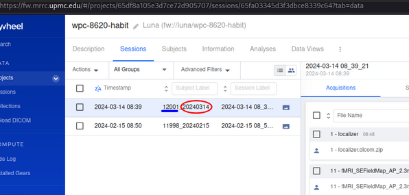
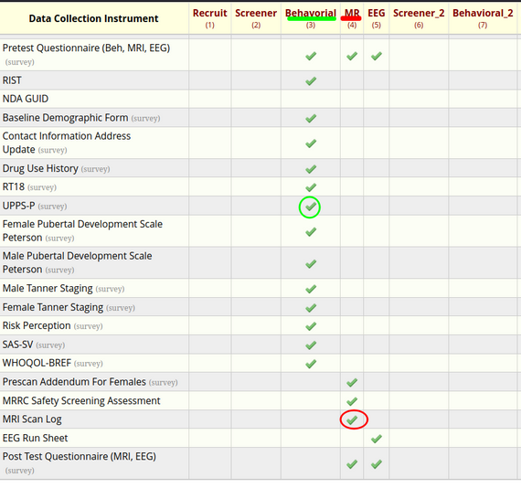

# Redcap → Flywheel

[`fwredcap.py`](fwredcap.py) matches flywheel session code to redcap data. Here we want to pull 2 separate values (`age_at_scan` and a previously recorded UPPS instrument value `upps_reservedattitude`) from redcap into flywheel. 

## Overview
After pulling data from flywheel and redcap, matching them requires
  1. separating the flywheel session code into id and date parts (NB. date unlikely to be in other IDs, see `sessions()[0].acqusistions()[0][timestamp`)
  1. massaging `mri_sub_arrival` to match the separated flywheel date
  1. match redcap df
  1. adjust criteria to match paired redcap event (`mr_1` -> `behavioral_1`)


## Flywheel
In the example flywheel project (path `luna/wpc-8620-habit`) there is a session assigned the id `12001_20240314` (set at scan time, flywheel extracted from DICOM header)


In this case, the flywheel session id is a combination of the participant's `readcap_id` and the scan date like `yyyymmdd`, a reformatted version of what's captured in redcap as `mri_sub_arrival`.

## Redcap

The `age_at_scan` variable of interest is recorded within the same event (`mr_arm_1`) as the field we use to match the MR session (`mri_sub_arrival`). However, `upps_reservedattitude` is not; it's in the `behavioral_arm_1` event.



Using [`PyCap`](https://redcap-tools.github.io/PyCap/), each event type is a new row. Pulling across event types requires matching against multiple rows.
```
redcap_id redcap_event_name      mri_sub_arrival  age_at_scan  upps_reservedattitude
   12001  behavorial_arm_1                  NaN          NaN                    1.0
   12001          mr_arm_1  2024-03-14 15:57:56         13.0                    NaN
```
